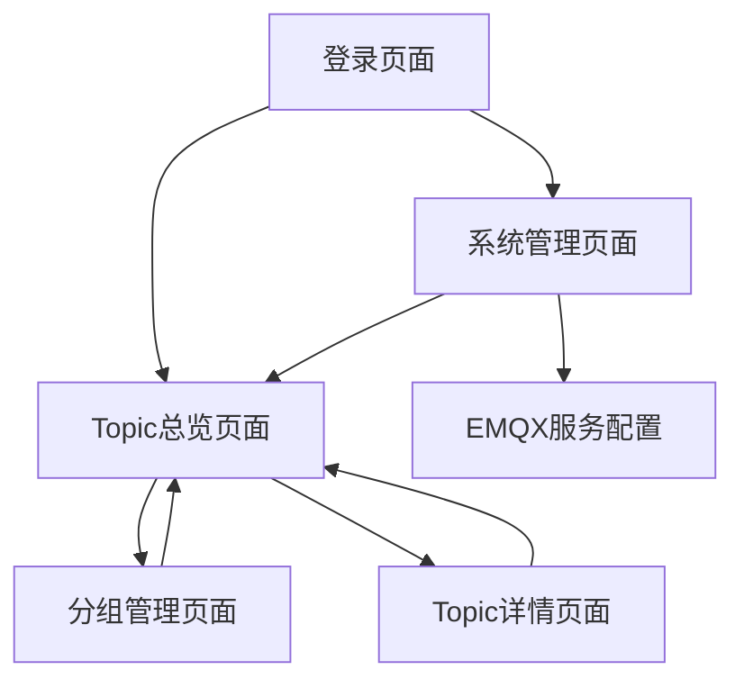

# EMQX Topic管理增强服务 - 产品需求文档

## 1. Product Overview
EMQX Topic管理增强服务是一个基于EMQX服务接口的Topic管理平台，提供多层级的Topic组织和管理功能。
- 解决EMQX原生Topic管理不便的问题，通过增强层提供更好的组织和可视化能力，支持多EMQX服务统一管理。
- 目标用户为使用EMQX的开发团队和运维人员，帮助他们更好地组织和管理大量的MQTT Topic。

## 2. Core Features

### 2.1 User Roles
系统采用单用户模式，无需复杂的用户权限管理：
- 系统启动时内置管理员账户（用户名：admin，密码：admin123）
- 管理员拥有所有功能权限：EMQX服务配置、Topic分组管理、标签管理等

### 2.2 Feature Module
我们的EMQX Topic管理增强服务包含以下主要页面：
1. **登录页面**：简单用户认证，EMQX服务选择
2. **系统管理页面**：EMQX服务配置管理，服务连接状态监控
3. **Topic总览页面**：多级分组展示，Topic搜索和筛选
4. **分组管理页面**：业务分组创建和编辑，分组层级管理
5. **Topic详情页面**：Topic信息展示，标签管理，历史记录

### 2.3 Page Details
| Page Name | Module Name | Feature description |
|-----------|-------------|---------------------|
| 登录页面 | 用户认证 | 用户登录验证，EMQX服务选择，记住登录状态 |
| 登录页面 | 服务选择 | 显示可用EMQX服务列表，支持服务状态检查 |
| 系统管理页面 | EMQX服务配置 | 添加、编辑、删除EMQX服务配置，测试连接状态 |
| 系统管理页面 | 服务监控 | 显示各EMQX服务连接状态，Topic同步状态，错误日志 |
| Topic总览页面 | 系统分组展示 | 树形结构展示EMQX系统分组，支持展开收起 |
| Topic总览页面 | Topic分组展示 | 在选定系统下显示业务分组，支持拖拽排序 |
| Topic总览页面 | Topic列表 | 显示分组下的Topic列表，支持搜索、筛选、分页 |
| Topic总览页面 | 快速操作 | Topic批量标注，快速分组移动，导出功能 |
| 分组管理页面 | 分组创建 | 创建新的业务分组，设置分组名称、描述、图标 |
| 分组管理页面 | 分组编辑 | 修改分组信息，调整分组层级关系 |
| 分组管理页面 | 分组删除 | 删除空分组，Topic重新分配确认 |
| Topic详情页面 | 基本信息 | 显示Topic名称、所属系统、创建时间、消息统计 |
| Topic详情页面 | 标签管理 | 添加、编辑、删除Topic标签，标签分类管理 |
| Topic详情页面 | 操作历史 | 显示Topic的分组变更、标注历史记录 |

## 3. Core Process

### 用户操作流程
1. 使用内置管理员账户登录系统
2. 配置EMQX服务连接信息
3. 系统自动同步EMQX中的Topic数据
4. 创建业务分组结构
5. 将Topic分配到相应业务分组
6. 为Topic添加标签和描述
7. 搜索和筛选Topic，查看Topic详细信息

## 4. User Interface Design

### 4.1 Design Style
- 主色调：#409EFF（蓝色），辅助色：#67C23A（绿色）、#E6A23C（橙色）
- 按钮样式：圆角按钮，支持悬停效果和禁用状态
- 字体：系统默认字体，标题14-16px，正文12-14px
- 布局风格：左侧导航 + 顶部面包屑 + 主内容区域，卡片式组件布局
- 图标风格：Element Plus图标库，简洁线性图标

### 4.2 Page Design Overview
| Page Name | Module Name | UI Elements |
|-----------|-------------|-------------|
| 登录页面 | 用户认证 | 居中卡片布局，蓝色渐变背景，白色输入框，圆角按钮 |
| 登录页面 | 服务选择 | 下拉选择器，服务状态指示灯（绿色/红色/灰色） |
| 系统管理页面 | EMQX服务配置 | 表格布局，操作按钮组，模态对话框表单 |
| 系统管理页面 | 服务监控 | 状态卡片，进度条，实时数据刷新 |
| Topic总览页面 | 系统分组展示 | 左侧树形菜单，可展开收起，选中高亮 |
| Topic总览页面 | Topic分组展示 | 中间区域卡片网格，拖拽排序，悬停效果 |
| Topic总览页面 | Topic列表 | 右侧表格，搜索框，筛选器，分页器 |
| 分组管理页面 | 分组操作 | 表单布局，图标选择器，颜色选择器 |
| Topic详情页面 | 信息展示 | 描述列表，标签组件，时间轴组件 |

### 4.3 Responsiveness
桌面优先设计，支持1200px以上宽屏显示，最小支持1024px分辨率。左侧导航在小屏幕下可收起为图标模式。