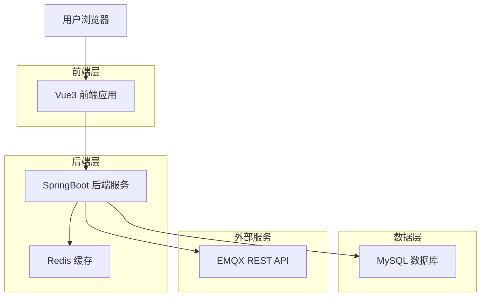
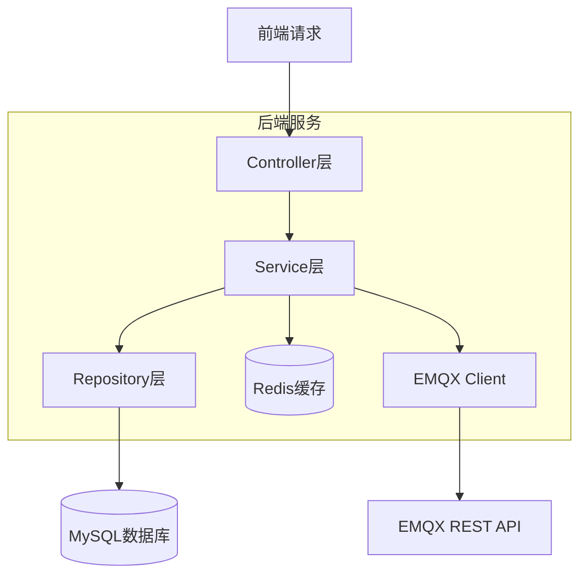
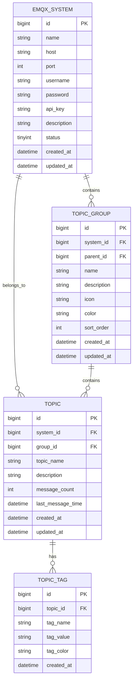

# EMQX Topic管理增强服务 - 技术架构文档

## 1. Architecture design



## 2. Technology Description

* Frontend: Vue3 + TypeScript + Element Plus + Vite + Pinia

* Backend: SpringBoot3 + JDK17 + MyBatis-Plus + Lombok + FastJSON

* Database: MySQL8.0 + Redis7.0

* External: EMQX REST API

## 3. Route definitions

| Route       | Purpose                  |
| ----------- | ------------------------ |
| /login      | 登录页面，简单用户认证和EMQX服务选择       |
| /dashboard  | 仪表板页面，显示系统概览和统计信息        |
| /systems    | 系统管理页面，EMQX服务配置和监控       |
| /topics     | Topic总览页面，多级分组和Topic管理   |
| /topics/:id | Topic详情页面，显示具体Topic信息和标签 |
| /groups     | 分组管理页面，业务分组的创建和编辑        |

## 4. API definitions

### 4.1 Core API

#### 用户认证相关

```
POST /api/auth/login
```

Request:

| Param Name   | Param Type | isRequired | Description |
| ------------ | ---------- | ---------- | ----------- |
| username     | string     | true       | 用户名（固定为admin）         |
| password     | string     | true       | 密码（固定为admin123）          |
| emqxSystemId | long       | false      | 选择的EMQX系统ID |

Response:

| Param Name | Param Type | Description |
| ---------- | ---------- | ----------- |
| success    | boolean    | 登录是否成功      |
| token      | string     | JWT访问令牌     |

#### EMQX系统管理相关

```
GET /api/systems
POST /api/systems
PUT /api/systems/{id}
DELETE /api/systems/{id}
POST /api/systems/{id}/test-connection
POST /api/systems/{id}/sync-topics
```

#### Topic管理相关

```
GET /api/topics
GET /api/topics/{id}
PUT /api/topics/{id}/tags
PUT /api/topics/{id}/group
GET /api/topics/search
```

#### 分组管理相关

```
GET /api/groups
POST /api/groups
PUT /api/groups/{id}
DELETE /api/groups/{id}
POST /api/groups/{id}/move
```

## 5. Server architecture diagram



## 6. Data model

### 6.1 Data model definition



### 6.2 Data Definition Language

#### EMQX系统表 (emqx\_system)

```sql
-- 创建EMQX系统表
CREATE TABLE emqx_system (
    id BIGINT PRIMARY KEY AUTO_INCREMENT COMMENT '主键ID',
    name VARCHAR(100) NOT NULL COMMENT 'EMQX系统名称',
    host VARCHAR(255) NOT NULL COMMENT 'EMQX服务器地址',
    port INT NOT NULL DEFAULT 18083 COMMENT 'EMQX管理端口',
    username VARCHAR(100) NOT NULL COMMENT 'EMQX管理用户名',
    password VARCHAR(255) NOT NULL COMMENT 'EMQX管理密码',
    api_key VARCHAR(255) COMMENT 'EMQX API密钥',
    description TEXT COMMENT '系统描述',
    status TINYINT NOT NULL DEFAULT 1 COMMENT '状态：0-禁用，1-启用',
    created_at DATETIME NOT NULL DEFAULT CURRENT_TIMESTAMP COMMENT '创建时间',
    updated_at DATETIME NOT NULL DEFAULT CURRENT_TIMESTAMP ON UPDATE CURRENT_TIMESTAMP COMMENT '更新时间'
) COMMENT 'EMQX系统配置表';

-- 创建索引
CREATE INDEX idx_emqx_system_status ON emqx_system(status);
CREATE UNIQUE INDEX uk_emqx_system_name ON emqx_system(name);
```

#### Topic分组表 (topic\_group)

```sql
-- 创建Topic分组表
CREATE TABLE topic_group (
    id BIGINT PRIMARY KEY AUTO_INCREMENT COMMENT '主键ID',
    system_id BIGINT NOT NULL COMMENT 'EMQX系统ID',
    parent_id BIGINT COMMENT '父分组ID',
    name VARCHAR(100) NOT NULL COMMENT '分组名称',
    description TEXT COMMENT '分组描述',
    icon VARCHAR(50) COMMENT '分组图标',
    color VARCHAR(20) COMMENT '分组颜色',
    sort_order INT NOT NULL DEFAULT 0 COMMENT '排序序号',
    created_at DATETIME NOT NULL DEFAULT CURRENT_TIMESTAMP COMMENT '创建时间',
    updated_at DATETIME NOT NULL DEFAULT CURRENT_TIMESTAMP ON UPDATE CURRENT_TIMESTAMP COMMENT '更新时间',
    FOREIGN KEY (system_id) REFERENCES emqx_system(id) ON DELETE CASCADE
) COMMENT 'Topic业务分组表';

-- 创建索引
CREATE INDEX idx_topic_group_system_id ON topic_group(system_id);
CREATE INDEX idx_topic_group_parent_id ON topic_group(parent_id);
CREATE INDEX idx_topic_group_sort_order ON topic_group(sort_order);
```

#### Topic表 (topic)

```sql
-- 创建Topic表
CREATE TABLE topic (
    id BIGINT PRIMARY KEY AUTO_INCREMENT COMMENT '主键ID',
    system_id BIGINT NOT NULL COMMENT 'EMQX系统ID',
    group_id BIGINT COMMENT '所属分组ID',
    topic_name VARCHAR(500) NOT NULL COMMENT 'Topic名称',
    description TEXT COMMENT 'Topic描述',
    message_count BIGINT NOT NULL DEFAULT 0 COMMENT '消息数量',
    last_message_time DATETIME COMMENT '最后消息时间',
    created_at DATETIME NOT NULL DEFAULT CURRENT_TIMESTAMP COMMENT '创建时间',
    updated_at DATETIME NOT NULL DEFAULT CURRENT_TIMESTAMP ON UPDATE CURRENT_TIMESTAMP COMMENT '更新时间',
    FOREIGN KEY (system_id) REFERENCES emqx_system(id) ON DELETE CASCADE,
    FOREIGN KEY (group_id) REFERENCES topic_group(id) ON DELETE SET NULL
) COMMENT 'Topic信息表';

-- 创建索引
CREATE INDEX idx_topic_system_id ON topic(system_id);
CREATE INDEX idx_topic_group_id ON topic(group_id);
CREATE INDEX idx_topic_name ON topic(topic_name);
CREATE UNIQUE INDEX uk_topic_system_name ON topic(system_id, topic_name);
```

#### Topic标签表 (topic\_tag)

```sql
-- 创建Topic标签表
CREATE TABLE topic_tag (
    id BIGINT PRIMARY KEY AUTO_INCREMENT COMMENT '主键ID',
    topic_id BIGINT NOT NULL COMMENT 'Topic ID',
    tag_name VARCHAR(50) NOT NULL COMMENT '标签名称',
    tag_value VARCHAR(200) COMMENT '标签值',
    tag_color VARCHAR(20) COMMENT '标签颜色',
    created_at DATETIME NOT NULL DEFAULT CURRENT_TIMESTAMP COMMENT '创建时间',
    FOREIGN KEY (topic_id) REFERENCES topic(id) ON DELETE CASCADE
) COMMENT 'Topic标签表';

-- 创建索引
CREATE INDEX idx_topic_tag_topic_id ON topic_tag(topic_id);
CREATE INDEX idx_topic_tag_name ON topic_tag(tag_name);
```

#### 系统配置说明

系统采用单用户模式，无需创建用户表。登录认证通过硬编码的管理员账户实现：
- 用户名：admin
- 密码：admin123
- 认证逻辑在后端代码中实现，无需数据库存储

